# Handle telemetry data from huge devices with real world structure
This repository provide samples of receiving, storing, processing huge telemetry data from huge devices with real world structure like Digital Twins by Azure IoT technology.

## お題  
複数の装置が設置されたプラントが多数あり、商品が決められた順番で装置で原料から加工され生産されている。装置にはセンサーが装備され装置の状況が計測可能になっている。  
その装置群の設置場所や構成を踏まえ、  
- 現状どうなっているか、モニターしたい
- 異常発生時には通知を受け、保守サービス等を手配したい
- 計測された一連のデータを元に過去どうだったか、異常が発生していれば何が原因だったかを振り返りたい
- 装置の設置場所、順番、設定等を変えたらどうなるのかを検証したい  

という、シナリオを想定する。  
この様な要件を満たすためには、
- 計測値（時系列データ）の蓄積  
- 装置の設置場所・構成の保持
- 特定条件の抽出、状況の通知、装置の制御
- 現在の状況表示、過去データの検索  

のための仕組みが必要である。  

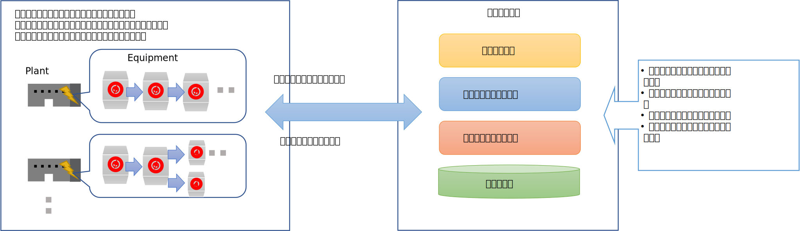

ここでは、このようなシステムの計測値蓄積、装置の設置場所・構成管理の部分にフォーカスをあて Azure IoT 関連技術・サービスを使って実現する、簡単なサンプルを紹介する。  

本サンプルでは、簡単のため、装置に装備されたセンサーは、温度センサーのみとし、以下の様なJSON形式のデータを送付してくるものとする。  
```json
{
    "deviceid": "thermostatic-chamber-1",
    "temperature": 29.32143299246807,
    "timestamp": "2021/09/28T11:17:09.344Z"
}
```
装置は、Windows 10 PC 上で実行するシミュレータで代替する。サービスは、Microsoft Azure の Managed Service を活用する。  

---
## 装置が送信するテレメトリーデータのサービス側での受信と蓄積  
プラントの数、装置の数が増えるに従い、送られてくるデータの頻度や量は増大していくため、サービス側での実現手段にはスケーラビリティが必要である。また、お題には、装置からサービスへのデータ送信だけでなく、サービス側から装置への制御も含まれ、通信は双方向であること、加えてセキュリティの観点から、装置それぞれの接続セキュリティが求められるため、装置とサービス間の接続・通信は、Azure IoT Hub を使って実現することとする。  
Azure IoT Hub インスタンスを作成し、'thermostatic-chamber-1'という名前の IoT Device を作成する。  
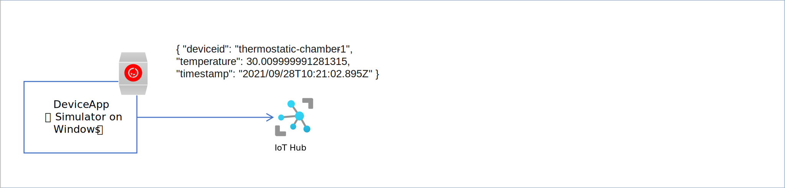

シミュレータアプリの実行方法、IoT Hubの設定方法は、[device-simulator-app](./device-simulator-app)を参照の事。  

---
時系列で装置から送られてくるテレメトリーデータの保存は、時系列データに特化した Apache Parquet フォーマットで Azure Storage の Blob Container に保存する Time Series Insights を使用する。  
Time Series Insights は、時系列データを効率よく保存できるだけでなく、指定した日時の範囲で特定の条件に合致した値を平均値、最大値、最小値等の統計処理を加えたデータを API を使って取得可能であり、簡単な装置の設置構造も保持できる仕組みを持っている。  
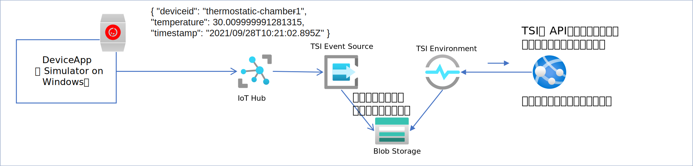  

設定方法は、[storing-telemetry-data.md](./storing-telemetry-data.md) を参照の事。  

---
## 設置場所、構成の管理  
Time Series Insights のモデル管理は単純な木構造であり、プラントと装置の設置関係はモデル化できるものの、生産工程における装置の順番や、木構造の中間層でのセンサーデータの保持等はできない。世の中一般に普通に存在しているような複雑なグラフ関係を保持するために、Azure Digital Twins を利用する。  
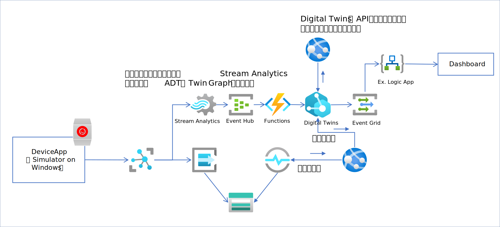
ここでは、IoT Hub を通じて送られてきた時系列データを Stream Analytics で統計処理し、Event Hub を通じて、Azure Function を起動し、Azure Digital Twins が保持している Twin Graph 上の該当する装置のプロパティを更新する。具体的には、temperature の1分あたりの平均値、最大値、最小値、標準偏差値を Stream Analytics で計算し、Azure Function のロジックを通じて Twin Graph 上のEquipment の Twin の TemAVG、TempMAX、TempMIN、TempSTD の各プロパティを更新する。  
Azure Digital Twins 用にまず、このお題の現実世界を保持可能な Twin Model を定義する。複数の装置がプラントに設置されていて、生産工程の順序を想定しているので、最低限のモデルとして、  
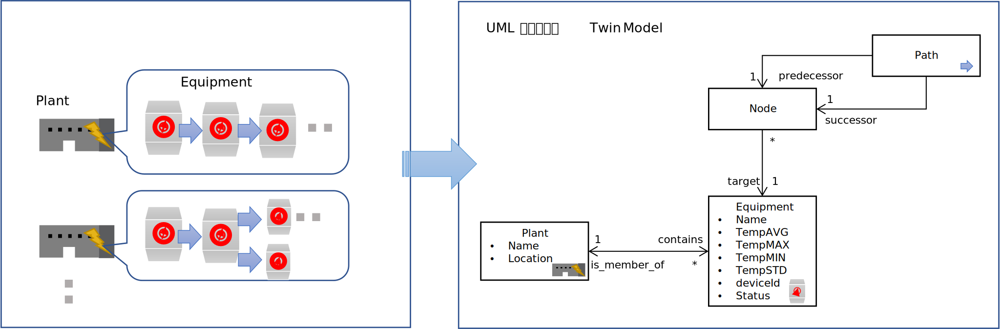  
で十分であろう。  
上図のモデルを元に DTDL で定義したJSONファイル群を[models/adt](./models/adt)に格納しているので、https://docs.microsoft.com/ja-jp/azure/digital-twins/quickstart-azure-digital-twins-explorer を参考に、Azure Digital Twins のインスタンスを作成し、Azure Digital Twins Explorer で DTDL ファイル群をアップロードし、色々な構成を想定して Twin Graph を試しに作成してみてほしい。  
例として、二つのケースを挙げておく。  
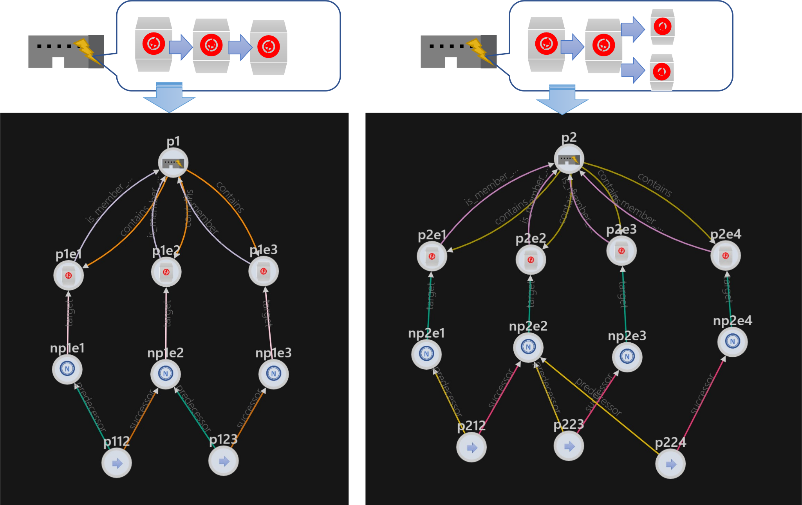  

UML表記で示した Twin Model は、  
- それぞれの Plant に設置された Equipment 群  
- 生産工程で定義された順番で Equipment が使われる  

という2つの概念を満たす全ての現実世界の構成を包含している。関連するサービス、アプリの設計を、Twin Model の定義をベースに進めることにより、再利用性の高いサービスやアプリの構築が可能である。  

ちなみに、「現実世界に存在するモノやコトの構成・構造が管理されている」とは、それらの情報が格納されているリポジトリから、以下が可能な事である。  
- ストアされている、モノ、コトがそれぞれ識別でき、ここに付与された識別子で見つけることができ、プロパティ情報が参照・更新できる。  
- 識別されたモノ、コトを起点にシステム上意味のある関係を辿って、その意味において関係している、モノ、コトをリストアップできる。  
Azure Digital Twins では、UML 表記で定義された Twin モデルで、Twin（モノ・コト）が持つ Property と Relationship が定義可能であり、それらの定義を使って上の二点を実現可能であり、加えて、現実世界の具体的な個々の状態によらず、Twin モデルのみでビジネスロジックの設計・実装を進めることが可能である。

このサンプルでは、簡単のため、最低限の Twin Graph で、機器 → IoT Hub → Stream Analytics → Event Hub → Function → Azure Digital Twins のサンプルを紹介する。  
作成する Twin と Relationship は以下の通り。  

<b><u>Twin の作成</u></b>
|Twinクラス|名前|アクション|
|-|-|-|
|Plant|plant1|作成し、Name、Location に適当な文字列を入力|
|Equipment|tsc-1|作成し、deviceIdに'thermostatic-chamber-1'と入力|
|Equipment|tsc-2|作成|

<b><u>Relationship の作成</u></b>  
|Relationship 名|From|To|
|-|-|-|
|contains|plant1|tsc-1|
|contains|plant1|tsc-2|
|is_member_of|tsc-1|plant1|
|is_member_of|tsc-1|plant2|

作成例は以下の通り  
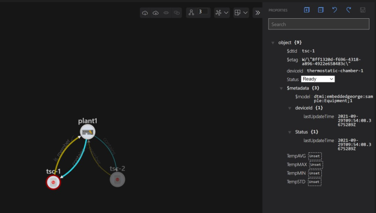  

Twin Graph の作成が終わったら、[hold-current-situation.md](./hold-current-situation.md) に従って、サービスを構築していく。
作成されたサービスを実行すると、thermostatic-chamber-1という名前の装置としてデータを送ってくるシミュレーターアプリのデータが刻一刻と Azure Digital Twins の Twin Graph 上に反映されていくので、Azure Digital Twins の API を使って必要な情報を取り出す、あるいは、Azure Digital Twins のメッセージルーティングを使って変更情報を受け取れば、今現在の状態をアプリケーションで表示可能になる。  

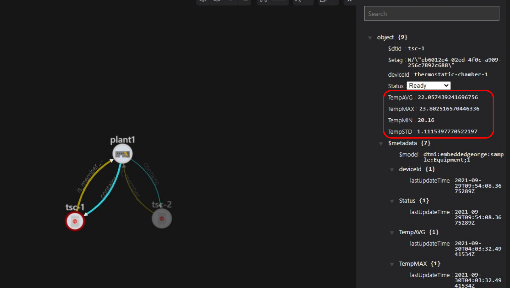

※ ここで紹介したサンプルは、機器が増えても、対応する Equipment の Twin を作成し、その deviceId プロパティに IoT Hub に登録した IoT Device の Device Id を設定すれば、そのまま実行可能である。  

---
## Time Series Insight の配置場所のバリエーション  
Time Series Insights は時系列データベースであるので、IoT Hub を介して送られてくる機器のセンサー等の時系列データだけでなく、ビジネスエンティティのプロパティで時系列的に変化するものも保存可能である。IoT Hub を通じて送られてくる機器からのデータにおいても、そのまま送信されたテレメトリーデータを保持する場合もあるし、サービス側で加工が必要なデータもある。  
目的・用途に応じた、Time Series Insights の配置例を図に示しておく。  
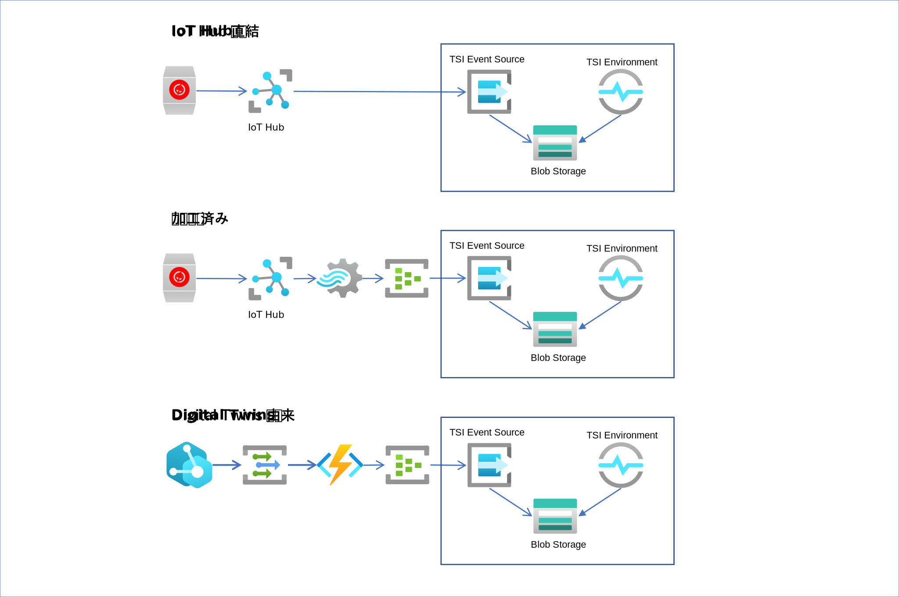

---
## Twin Graph の変更履歴  
さて、Twin Graph が一旦作構成されたら、その後一切変わらなければ、これで話はおしまいになる。しかし、Twin Graph は現実世界のレプリカなので、現実世界で起こりうる、設備機器の置き換え、製造工程の変更、製造物の改善、…、等々様々な変更を、都度々々、Twin Graph に反映させなければならない。  
その場合、Twin や Relationship の削除や新しい Twin や Relationship の作成による置き換えや、一部の Twin Model の定義を更新してバージョンを付け替えて、Twin や Relationship の更新が必要になる。  
良くも悪くも、Azure Digital Twins が保持している Twin Gpraph は、"<b>今どうなっているか</b>"を保持する仕組みに過ぎない。  
Twin Graph が変化してしまうと、過去に蓄積した時系列データとの整合がそのままでは取れなくなってしまう。例えば、ある複数の製造装置から構成された製造ラインに設置された"恒温槽-A"の"温度"プロパティの時系列データを、Time Series Insights に保存し続けていたとする。製造ラインの変更により、"恒温槽-A"がなくなり、Twin Graph 上から消えたとすると、もはや、Azure Digital Twins から辿って、Time Series Insights に対して"恒温槽-A"の"温度"を取り出すこともできないし、計測した時点の製造ラインの状況も失われてしまう。  
つまり、過去から現在までを一貫して取り扱いたいなら、Twin Graph の変化履歴を保持する仕組みが必要になる。  
ここで、間違っても、「じゃあ、Twin Graph の変化もモデル化して、Twin Model に追加して、Azure Digital Twins で変化の履歴も保持しよう！」…なんて、センスの悪い技術屋が考えそうなことをやってはいけない。単に扱いにくい Twin Model が出来上がって生産性を落とすだけである。  
製造ラインに大きな変更があったとき、変更前と変更後を比較することはあっても、変更前から変更後までの時系列データを連続したデータとしてみてみたいという事は無いだろう。よって、素直に、Azure Digital Twins instance を新しく用意して、古いものはそのまま残し、新しい Twin Model を元にした新しい Twin Graph を作成するのが良いだろう。  
※ 勿論、新しく作られた Azure Digital Twins Instance への Telemetry 入力処理、Twin Graph 操作処理、Event Routing 処理の追加は必要になるが。こちらは、以前から使っていた Function 等そのまま流用できるものもあれば、新しい Twin Model 向けの改変も必要だろう。Azure Digital Twins はただ単に Twin Graph を保持しているだけなら利用料は発生しないので残していてもコストへのインパクトはないし、過去の仕組みはそのまま残しておいた方が、開発・運用の観点からも安全であろう。    

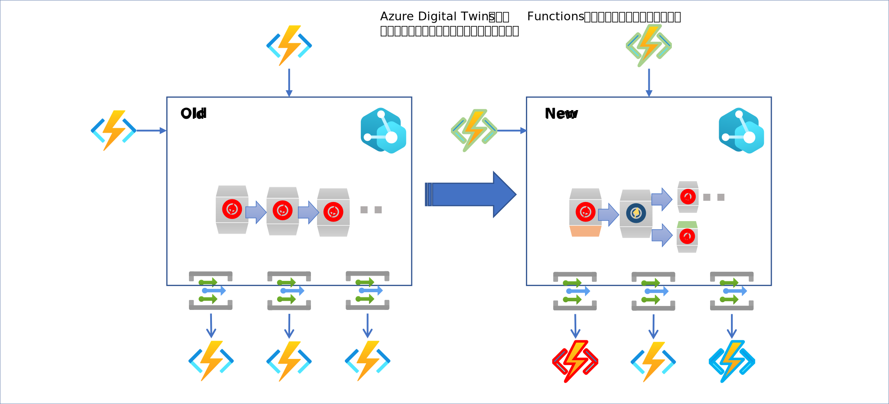

また、小幅の構成変更や Property 更新の場合は、Twin Graph の更新通知を JSON 化してCosmos DB に保持しておき、後で "過去どうだったか" を知りたいときに、（こちらも）新しく Azure Digital Twins Instance を作成して、Cosmos DB に記録された更新情報を元に、Twin Graph を再構成するのが良いと思われる。  
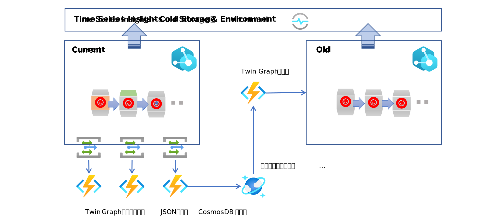  
Azure Digital Twins が Event Grid を介して Function に送ってくるデータは、C#の場合、[EventGridEvent](https://docs.microsoft.com/en-us/dotnet/api/microsoft.azure.eventgrid.models.eventgridevent?view=azure-dotnet) の型のデータで転送される。Twin Graph の更新内容は、Data プロパティに文字列で入っているので、一旦、JSON にデシリアライズし、EventGridEvent の、  
- EventTime  
- EventType  
- Subject  
- Topic  
と合わせて、JSON 変数を作り、シリアライズして、Cosmos DB にストアすればよい。  
Function は、Cosmos DB への出力バインディングがサポートされている（https://docs.microsoft.com/ja-jp/azure/azure-functions/functions-bindings-cosmosdb-v2-output?tabs=csharp）おり、これを使えば非常に簡単に Cosmos DB に Twin Graph の変更を逐次保存できる。  
過去の分析がしたい時点で、Azure Digital Twins Instance を新しく作成し、Cosmos DB に蓄積された更新情報を EventTime 順に取出し、Twin Graph を構成、更新していけば、過去の希望の時点の Twin Graph を再現できる。  

※ Time Series Insights のモデルは、かっちり定義されたものというよりは、時系列データを分析したいときに、どういう視点でデータ単位を扱うかによって、都度都度、定義するもの、と考えると上手い活用ができると思われる。  
