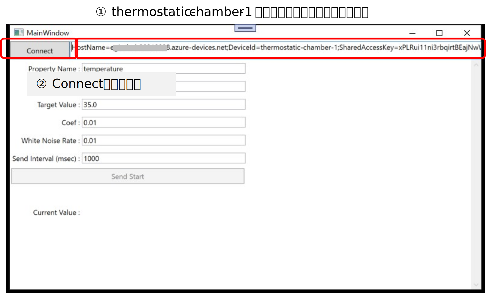
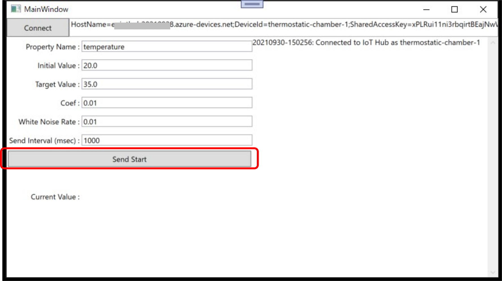
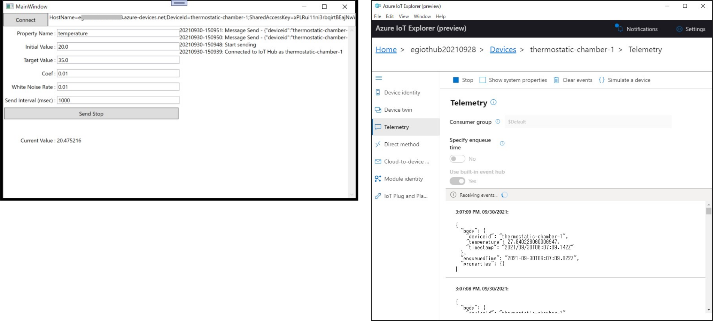

# How to set up IoT Hub and Device Simulator Application  
まず、Azure IoT Hub インスタンスを作成し、IoT Device を <b>'thermostatic-chamber-1'<b>という名前で登録する。  
方法は、https://docs.microsoft.com/ja-jp/azure/iot-develop/quickstart-send-telemetry-iot-hub?pivots=programming-language-csharp を参照の事。  
Visual Studio 2019で、[WpfAppIoTDeviceSimulator.sln](./WpfAppIoTDeviceSimulator.sln)を開き、WpfAppIoTDeviceSimulatorプロジェクトを実行する。  
登録した <b>'thermostatic-chamber-1'</b> の接続文字列を上部のテキストボックスにコピーし、<b>Connect</b> ボタンをクリックする。  

  

シミュレータアプリが、IoT Hub に接続される。  
<b>Start Sending</b> ボタンをクリックすると、IoT Hub へのメッセージ送信が開始される。  

  

実際に送信されているかどうかは、Azure IoT Explorer で確認できる。  

以上で、IoT Hub インスタンスの作成と、シミュレーターアプリによるテレメとりデータ送信ができるようになった。  
