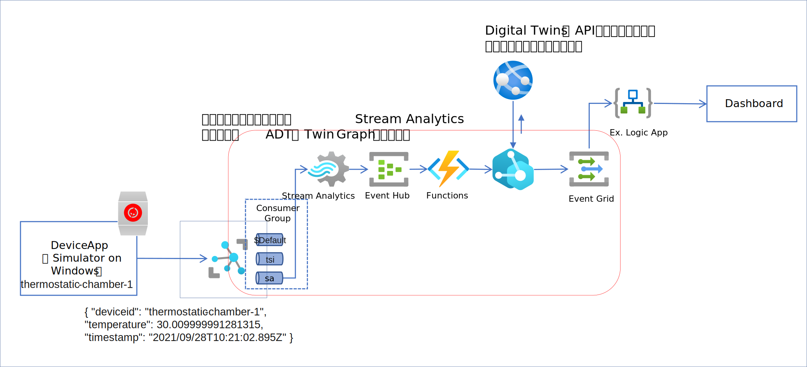
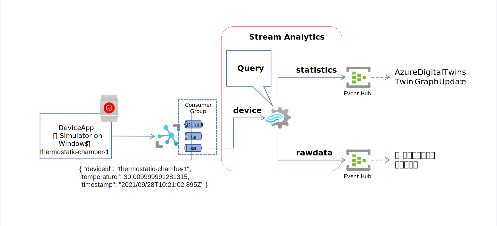
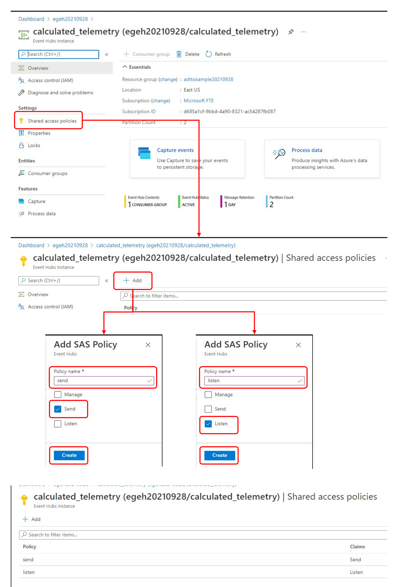
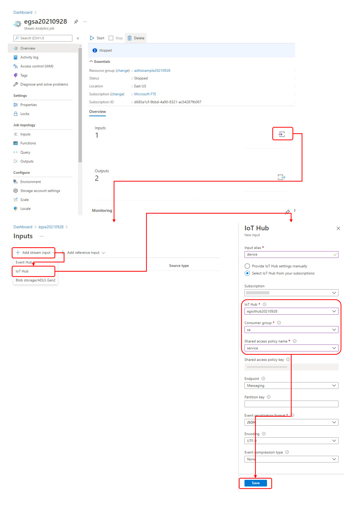
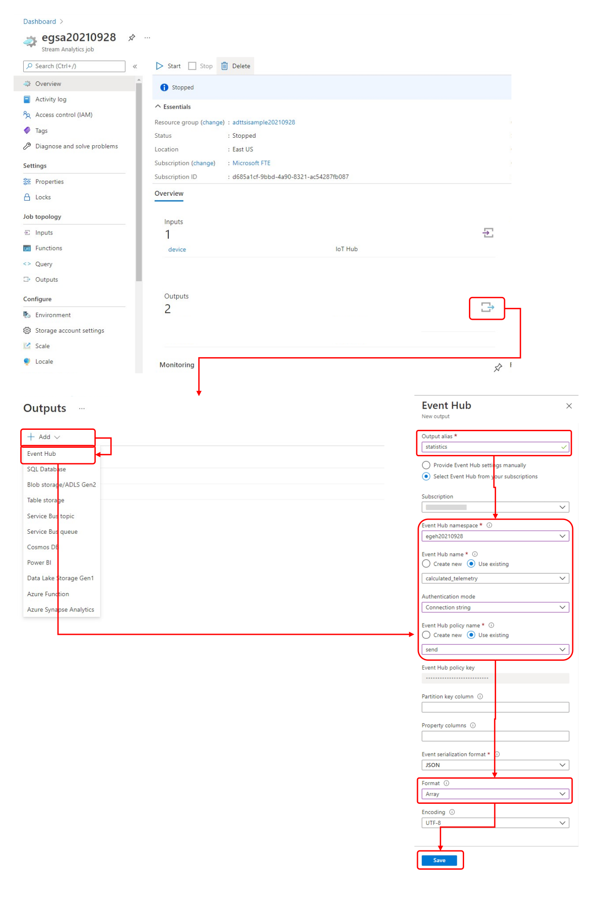
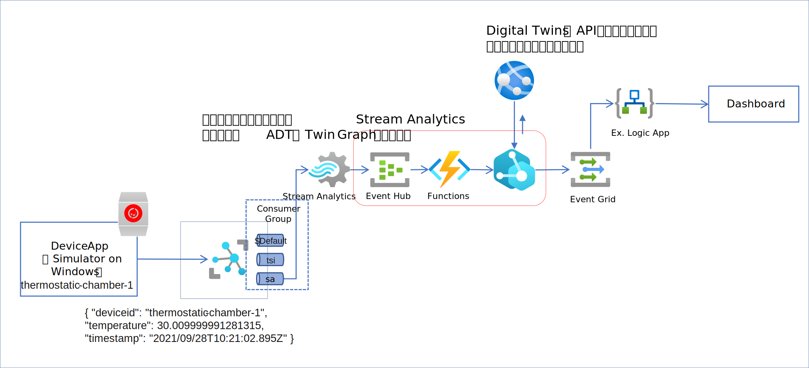
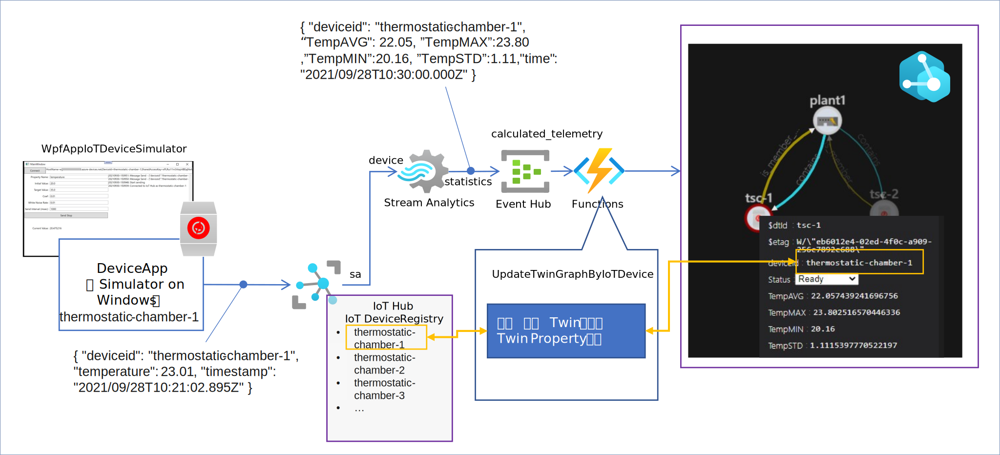

# Hold Current Situation with real world structure  
[storing-telemetry-data.md](./storing-telemetry-data.md)で紹介したように Time Series Insights は、蓄積された複数機器のテレメトリーデータから、単純な木構造モデルに従って、特定の時間レンジのものだけ、一定のフィルターを適用して取り出すことができる。  
しかし、生産工程の手順に基づいた機器の順序関係や中間層の機器の計測値等、より複雑な現実世界の構造は、Time Series Insights では管理できない。また、メッセージ駆動で動作す、常に最新のデータを表示し続けるようなダッシュボード的なアプリケーションや、何らかの条件を満たす時系列データが発生した場合に後段のサービスにデータを渡したいような用途向けの機能を Time Series Insights は持っていない。  
これら、  
- より複雑な現実世界の構造の管理  
- 時系列データの到着をトリガーにした、後段サービスのメッセージ駆動  

を実現する機能は Azure Digital Twins が提供する。  
ここでは、[README.md](README.md)で紹介した、全体のアーキテクチャのうち、
下図の赤枠で囲んだ部分の作成方法を紹介する。  

  

この構成では、IoT Hub を通じて受信した装置のテレメトリーデータを、  
- Azure Digital Twins インスタンス内で構築された Twin モデルの構成に合わせて、Stream Analytics で テレメトリーデータに統計処理を施し、Event Hub に送信  
- Event Hub のデータ受信をトリガーに Function が起動され、Azure Digital Twins の Twin Graph を更新  

というステップで処理が同時並行的に動いていく。実際のシステムでは、装置は複数あり、それぞれの装置が独立でテレメトリーデータを送信してくる。装置の数が多くなれば、送信されてくるテレメトリーデータ量も比例して増大し、サービス側の処理量も増加していく。ここに挙げている構成は、データ量が増加しても対応できるスケーラビリティが考慮されたアーキテクチャになっている。  
システムにスケーラビリティがあることは、実際のビジネスで使われる IoT 系ソリューション構築においては非常に重要なポイントであり、PoC（技術の事前検証）では、見落とされがちなポイントであるので十分に留意すること。  
スケーラビリティが考慮されていない IoT ソリューションは、装置の数が少ない場合は問題ないが、装置の数が増大して処理量が増えた場合は、膨大な労力をかけて運用を続けるか、最悪位置から作り直しになる。  

※ IoT ソリューションの構築において、スモールスタートで始めて継続的に大きく育てていく、というのが常道ではあるが、あくまでも、対称装置の数やエンドユーザーに提供する機能数の事であり、チープなシステム構成で始めるという意味ではない。  
※ IoT ソリューションを構成するサービス群のスケーラビリティだけでなく、段階的な機能追加が可能な Adaptive なアーキテクチャであることも必要である。このサンプルは、メッセージ駆動型のアーキテクチャを採用することにより Adaptive なアーキテクチャを採用している。  

---
## IoT Hub → Stream Analytics  
Stream Analytics の作成と設定を行う。  

  

図の赤枠で囲った部分が Stream Analytics の定義の部分を示している。  
Stream Analytics の作成、入力、出力の追加、クエリ作成、実行方法は、https://docs.microsoft.com/azure/stream-analytics/stream-analytics-quick-create-portal を事前に熟読して具体的な手順を頭に入れていただきたい。  

Stream Analytics 作成の前に出力先の Event Hub を二つ作成する。  
Event Hub の作成は、まず、Event Hub Namespace を作成し、二つの Event Hub を作成する。  
Event Hub Namespace は、https://docs.microsoft.com/azure/event-hubs/event-hubs-create の説明に従って、IoT Hub と同じリソースグループを使って作成する。2つの Event Hub は、

- calculated_telemetry  
- raw_telemetry  

という名前でそれぞれ作成する。作成後、両方の Event Hub の送信・受信用のロールを作成する。  

  

|ロール名|権限|用途|
|-|-|-|
|send|Send|Stream Analytics の出力からの送信用|
|listen|Listen|Function へのデータ転送用|

以上で、Stream Analytics 定義の準備が整ったので、Stream Analytics インスタンスを IoT Hub と同じリソースグループ（同じ Location・Region が望ましい）で作成する。  

### Input alias の作成  
Stream Analytics インスタンスを作成したら、<b>Input</b>を定義する。図の様に、    
1. Stream Input で IoT Hub インスタンスを選択
2. <b>Consumer Group</b> は <b>sa</b> (IoT Hub 側で作成しておくこと) を選択
3. <b>Shared access policy name</b> は、<b>service</b> を選択  
4. <b>Save</b> をクリックして保存  

  

で、IoT Hub のテレメトリーデータ受信口を Stream Analytics の Input にバインドする。  

### Output alias の作成  
次に、Stream Analytics の出力を二つ作成し、先程作成した Event Hub をバインドする。  
Output は、<b>statistics</b> と <b>rawdata</b> の2つの Output alias をそれぞれ以下の内容で作成する。  
|Output alias|Event Hub Name|
|-|-|
|statistics|calculated_telemetry|
|rawdata|raw_telemetry|
二つの Output alias を以下の手順でそれぞれ作成する。  
1. <b>Outputs</b> を選択し、<b>+Add</b> をクリックして、<b>Event Hub</b>を選択。  
2. <b>Output alias</b> に、前述の表に示した Output alias 名前を入力。
3. <b>Event Hub namespace</b>は、前のステップで作成した Event Hub Namespace を選択  
4. <b>Event Hub name</b> は、<b>Use existing</b> をクリックして、前述の表に示した Event Hub Name の Event Hub を選択  
5. <b>Event Hub policy name</b> は、<b>Use existing</b> をクリックして、<b>send</b> を選択  
6. <b>Format</b> は、<b>Array</b> を選択  

  

※ Stream Analytics は、処理後のデータを出力する際、処理結果を複数まとめて出力する場合がある。その際、Format を Array に設定しておくと、JSON の配列形式で後段のサービスがデータ受信できる。  

### Query の定義  
クエリーは、二つ定義する。一つは、平均値、最大値、最小値、標準偏差を計算して、<b>statistics</b> に出力する、もう一つは、<b>rawdata</b> に <b>device</b> から入力したデータをそのまま出力するクエリーである。  
Azure Portal で Stream Analytics インスタンスの Overview を表示しているページで、右側の Query のパートの <b>Edit query</b> をクリックして、以下のクエリーを入力し、保存する。  
```sql
# device -> calculate statistics in 60 seconds -> statistics
SELECT
    deviceId, System.TimeStamp() as Time, AVG(temperature) as TempAVG, MAX(temperature) as TempMax, MIN(temperature) as TempMin, STDEV(temperature) as TempSTD
INTO
    [statistics]
FROM
    [device] TIMESTAMP by timestamp
GROUP BY
    deviceId, TumblingWindow(second, 60)

# device -> no processing -> rawdata
SELECT * INTO [rawdata] FROM [device] TIMESTAMP by timestamp
```

以上で、Stream Analytics の設定は終了。<b>▷ Start</b> をクリックすると、ジョブが起動し、IoT Hub からデータが送られてくるたびに、クエリーで定義された処理が実行され、Event Hub に送信される。  

※ Event Hub は大量のメッセージの送受信が可能なメッセ―キューであり、Stream Analytics から送信されたデータをキューに貯め、後段にサービスがサブスクライブされていれば、そのサービスに受信したメッセージを順番に送信していく。Event Hub の後段へのサブスクライブは、いつでもできるので、Stream Analytics の出力を使って何かロジックを実行したいサービスを後付けで追加していく事（Adaptive）が可能である。  

---
## Twin Graph 更新ロジックの構築  
次に、Stream Analytics で統計処理した時系列データの最新の値を、Twin Graph 上の対応する Twin のプロパティ値に設定する処理方法を説明する。  
※ 図の赤枠で囲った部分  

  

Event Hub Trigger で実行する Azure Function を作成する。  

Azure Function の開発方法の基本は、
|IDE|参考URL|
|-|-|
|VS Code|https://docs.microsoft.com/ja-jp/azure/azure-functions/functions-develop-vs-code?tabs=csharp|
|Visual Studio 2019|https://docs.microsoft.com/ja-jp/azure/azure-functions/functions-develop-vs?tabs=in-process|  
を参考にすること。  

Event Hub Trigger Template を使って、プロジェクトを作る。プログラミング言語は、このサンプルでは C# を使う。  
Azure Digital Twins にアクセスするために、以下の Nuget パッケージをインストールする。  
- Azure.Core
- Arzue.DigitalTwins.Core  
- Azure.Identity  

加えて、JSON を扱うために、  
- Newtonsoft.Json  
もインストールしておくと便利である。  

Azure Digital Twins インスタンスへのアクセスは、Azure.DigitalTwins.Core パケージで提供される Azure Digital Twins SDK を使って行う。 
https://github.com/ms-iotkithol-jp/AzureDigitalTwinsModelingTips/blob/main/tutorial/HowToBuildAppWIthADT.md#function-applications から Azure Digital Twins にアクセスする Function の開発サンプルを公開しているので、そちらも参考にしていただきたい。 
Azure Digital Twins インスタンスを作成・運用している Azure Subscription で、Azure Function をクラウド上に配置している場合の、認証用コードは以下の通り。  

```cs
        static DigitalTwinsClient twinsClient;
        static readonly HttpClient httpClient = new HttpClient();
        static readonly string adtInstanceUrl = Environment.GetEnvironmentVariable("ADT_SERVICE_URL");
        [Function("UpdateTwinGraphByIoTDevice")]
        public static async Task Run([EventHubTrigger("calculated_telemetry", Connection = "calculated_telemetry_listen_EVENTHUB")] string[] input, FunctionContext context)
        {
            var logger = context.GetLogger("UpdateTwinGraphByIoTDevice");
            logger.LogInformation($"First Event Hubs triggered message: {input[0]}");
            var exceptions = new List<Exception>();
            if (twinsClient == null)
            {
                try
                {
                    if (string.IsNullOrEmpty(adtInstanceUrl)) logger.LogInformation("Application setting \"ADT_SERVICE_URL\" not set.");
                    else logger.LogInformation($"Got {adtInstanceUrl}");
                    var credential = new ManagedIdentityCredential("https://digitaltwins.azure.net");
                    twinsClient = new DigitalTwinsClient(
                        new Uri(adtInstanceUrl),
                        credential,
                        new DigitalTwinsClientOptions
                        {
                            Transport = new Azure.Core.Pipeline.HttpClientTransport(httpClient)
                        }
                    );
                    logger.LogInformation($"ADT service client connection created - {adtInstanceUrl}");
                }
                catch (Exception ex)
                {
                    exceptions.Add(ex);
                    logger.LogWarning($"ADT Exception - {ex.Message}");
                }
            }
```
※ ADT_SERVICE_URL は、ローカルデバッグ環境では、[local.settings.json](twingraph-update-function/local.settings.json)の Values の中で、作成済みの Azure Digital Twins インスタンスの URL を設定しておくこと。Azure にデプロイ後は、Azure Function の環境で設定しておくこと。  
  
※ 上のコードは、Azure 上にデプロイしている時のコードであり、VS Code、もしくは、Visual Studio でローカルデバッグを行う場合は、開発環境の Azure へのサインインの権限を使うので、  
```cs
                    var credential = new ManagedIdentityCredential("https://digitaltwins.azure.net");
```
を
```cs
                    var credential = new DefaultAzureCredential();
```
に置き換えること。  

Event Hub の <b>calculated_telemetry</b> にメッセージが送信されると、<b>Run</b> メソッドの引数 <b>input</b> を通じてメッセージが JSON フォーマットの文字列で渡される。  
そのメッセージには、どの装置からテレメトリーデータが送られてきたかを示す、<b>deviceId</b> プロパティがあるので、先ずそれを取り出す。  
```cs
            foreach (var msg in input)
            {
                try
                {
                    string msgContent = msg;
                    if (msg.StartsWith("[") && msg.EndsWith("]"))
                    {
                        msgContent = msg.Substring(1, msg.Length - 2);
                    }
                    dynamic jsonMsg = Newtonsoft.Json.JsonConvert.DeserializeObject(msgContent);
                    string deviceId = jsonMsg["deviceId"];
```
Twin Graph 側では、<b>Equipment</b> Twin クラスが <b>deviceId</b> プロパティを持っていて、IoT Hub の IoT Device レジストリ上で管理されているデバイスID で管理されている装置と、Twin インスタンスの対応情報を格納しているので、以下のコードで、受信した <b>deviceId</b> を使って、Twin Graph から対応する、Twin インスタンスを以下のコードで検索する。  
```cs
                    string query = $"SELECT * FROM digitaltwins WHERE IS_OF_MODEL('dtmi:embeddedgeorge:sample:Equipment;1') AND deviceId = '{deviceId}'";
                    var queryResponse = twinsClient.QueryAsync<BasicDigitalTwin>(query);
                    BasicDigitalTwin tscTwin = null;
                    await foreach (var t in queryResponse)
                    {
                        tscTwin = t;
                        break;
                    }
```
対応する Twin インスタンスを検索後、Stream Analytics の処理結果の、TempAVG、TempMAX、TempMIN、TempSTD を以下のコードで更新する。  
```cs
                    if (tscTwin != null)
                    {
                        double tempAVG = jsonMsg["TempAVG"];
                        double tempMAX = jsonMsg["TempMax"];
                        double tempMIN = jsonMsg["TempMin"];
                        double tempSTD = jsonMsg["TempSTD"];
                        var newProps = new Dictionary<string, object>();
                        newProps.Add("TempAVG", tempAVG);
                        newProps.Add("TempMAX", tempMAX);
                        newProps.Add("TempMIN", tempMIN);
                        newProps.Add("TempSTD", tempSTD);
                        var patch = new JsonPatchDocument();
                        foreach (var key in newProps.Keys)
                        {
                            if (tscTwin.Contents.ContainsKey(key))
                            {
                                patch.AppendReplace($"/{key}", newProps[key]);
                            }
                            else
                            {
                                patch.AppendAdd($"/{key}", newProps[key]);
                            }
                        }
                        await twinsClient.UpdateDigitalTwinAsync(tscTwin.Id, patch);
```
Azure Digital Twins が管理する Twin のプロパティは、設定されるまで存在しない。そのため、検索した Twin に更新したいプロパティが存在しているかをチェックして、無ければ、<b>AppendAdd</b>、あれば、<b>AppendReplace</b> メソッドを使って、更新内容を <b>JsonPatchDocument</b> クラスを使って構築し、<b>DigitalTwinsClient</b> の </b>UpdateDigitalTwinsAsync</b> メソッドを使って、Azure Digital Twins インスタンスに通知を行う。  

以上、解説してきた内容を元にしたサンプルを [twingraph-update-function](./twingraph-update-function) で公開しているので、VS Code や Visual Studio でプロジェクトファイルを開き、試してみていただきたい。  



---
## Twin Graph Update Notification  
Twin Graph 更新を Event Grid に通知し、それをトリガーに Function を起動する方法は、https://github.com/ms-iotkithol-jp/AzureDigitalTwinsModelingTips/blob/main/tutorial/HowToBuildAppWithADT.md#propagate-consistency-twin-graph を参照の事。  

---
## Access to Twin Graph  
C# による Twin Graph へのアクセスのサンプルは、https://github.com/ms-iotkithol-jp/AzureDigitalTwinsModelingTips/blob/main/tutorial/HowToBuildAppWithADT.md#wpf-application を参考の事。  
JavaScript による Twin Graph へのアクセスのサンプルは、https://docs.microsoft.com/samples/azure/azure-sdk-for-js/digital-twins-core-javascript/ を参照の事。  

