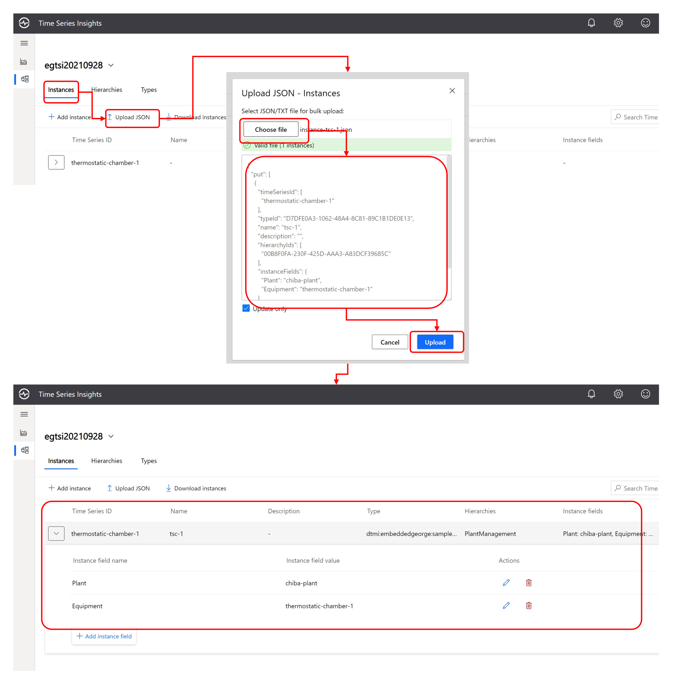

# Storing Telemetry Data into Time Series Insight  
IoT Hub で受信した機器からの時系列データを、時系列データ保存用サービスの Time Series Insights で保存するサンプルを紹介する。  
作業は非常に簡単で、Time Series Insights を作成する際に、データソースとして Azure IoT Hub インスタンスを指定するだけでよい。  

  

IoT Hub は、サービス側のテレメトリーデータ受信エンドポイントで、Consumer Group を介して後段のサービスにデータを受け渡す。  
Time Series Insights インスタンスは以下の手順で作成していく。  
1. IoT Hub と同じリソースグループを選択する。  
1. <b>Environment Name</b> を入力し、IoT Hub と同じ <b>Location</b>(リージョン) を選択。<b>Tier</b> は <b>Gen2</b> を選択する。  
1. <b>Property name</b> は、IoT Hub から送られてくるデータの中のデバイスIDを示すプロパティ名、つまり、<b>'deviceid'</b> と入力する。  
1. <b>Storage account name</b> に、テレメトリーデータを格納する Blob Container 用の Storage Account のインスタンス名を入力する。  

一通り入力が終わったら、<b>'Next: Event Source >'</b> をクリックして、次に進む。  
※ <b>Property Name</b> で指定したプロパティ <b>deviceid</b> の値(IoT Hub のレジストリで IoT Device として登録されたデバイスの名前)は、Time Series Insights の Environment 上では、<b>Time Series ID</b> という名前で管理され、一度に複数のセンサー計測値（例えば、温度と湿度のセットや、3軸加速度、多種類のセンサー計測値のセット等）が送られてくる場合は、Time Series ID として束ねられる。


次に、Time Series Insights の Event Source に IoT Hub インスタンスを指定する。  
1. <b>Source type</b> で <b>IoT Hub</b> を選択。  
1. <b>Name</b> に、'equipments' と入力。  
1. <b>IoT Hub name</b> で、シミュレーターアプリからデータを送っている IoT Hub インスタンスを選択。  
1. <b>IoT Hub access policy name</b> は、バックエンドサービスからのデータ受信用の接続なので、<b>service</b> を選択。  
1. <b>IoT Hub consumer group<b> は、予め IoT Hub 側で Time Series Insights 用の Consumer Group を作成済みならそれを選択、あるいは、未作成であれば、<b>New</b> をクリックして <b>tsi</b> と入力。  
1. <b>Timestamp</b> の <b>Property name</b> は、IoT Hub から送られてくるデータの中の計測時間を示すプロパティ名、つまり、<b>'timestamp'</b> と入力。  

一通り入力し終わったら、<b>Review + Create</b> をクリックした後、Time Series Insights インスタンスを作成する。  


Time Series Insights インスタンスの作成が完了すると、シミュレーターアプリがデータを送信している場合は、自動的にデータを受信し、順次、Blob Container に、Parquet フォーマットで時系列データとして保管される。  

---

## モデル（階層）の定義  
Time Series Insights は、<b><u>プラント</u></b>に設置された<b><u>装置</u></b>という様な、現実世界の階層をモデル化できる。  

  

※ 図は、二階層のケースを表現しているが、プラント→フロアー→装置というような、3階層以上も表現可能である。  
※ Time Series Insights のモデルはあくまでも階層表現だけであり、生産工程における装置の使用順序等といった、より複雑な構成は表現できない。  

Time Series Insights では、このような階層を、<b>Hierachies</b> と言い、センサーデータを持つ最下層の要素（装置・機器・デバイス）を、<b>instance</b> という。  
モデルの定義は、
1. <b>instance</b> のセンサー計測値のデータ定義（<b>types</b>)  
1. <b>Hierachies</b> の定義  
1. <b>Instance</b> の定義  

の順番で行う。モデルの定義は、Time Series Insights Environment の Explorer の GUI を使って手作業でも行えるが、ここでは、JSONファイルをあらかじめ作成して登録していく方法を紹介する。    

### types の定義
このサンプルでは、<b>temperature</b> をデータとして送ってくるので、<b>types</b> の定義は以下の様な JSON となる。  
```json
{
  "put": [
    {
      "id": "D7DFE0A3-1062-48A4-8C81-89C1B1DE0E13",
      "name": "dtmi:embeddedgeorge:sample:thermostaticchamber;1",
      "description": "TSI sample",
      "variables": {
        "temperature": {
          "kind": "numeric",
          "value": {
            "tsx": "$event.[temperature].Double"
          },
          "aggregation": {
            "tsx": "avg($value)"
          }
        }
      }
    }
  ]
}
```
<b>id</b> は、既に定義されたデータ型（デフォルトで、<b>DefaultType</b>という名前が Time Series Insights Environment に定義されている）で使われている値とは異なる値を指定する。  
<b>name</b> は、ここでは、DTDL（Digital Twins Definition Language）の規定に従って、<b>thermostaticchamber</b> が送ってくるデータセットとしての名前を記述している。  
<b>variables</b> の中の、<b>temperature</b> は、Time Series Insights が認識するセンサーデータ項目名である。下位のプロパティの、<b>value.tsx</b>内で、IoT Hub から送られてくるテレメトリーデータの <b>temperature</b> プロパティで、かつ、値が数値で <b>Double</b> 型であることを示している。更に、<b>aggregation</b> で、<b>avg($value)</b> つまり、テレメトリーデータの <b>temperature</b> の平均値を表示するよう指定している。  
※ 送られてくるテレメトリーデータが複数のセンサー計測値を持っている場合は、<b>variables</b>の子要素として、<b>temperature</b> と同様な様式でそれぞれ追加していけばよい。  

JSON ファイルは以下の手順で Time Series Insights Environment の Explorer の GUI で登録を行う。  
1. 作成した Time Series Insights インスタンスを Azure Portal で開き、<b>Go to TSI Explorer</b> をクリックする。  
1. Explorer が表示されたら、<b>モデルアイコン</b>をクリックして、モデル定義の画面を表示する。  
1. <b>Types</b> をクリックして、データ型のページを開き、<b>Upload JSON</b> をクリックする。  
1. <b>Choose file</b> をクリックして、[models/tsi/types.json](models/tsi/types.json)を選択する。  
1. 内容が検証されて結果が表示されるので、<b>Upload</b> をクリックする。  

以上で、Time Series Insights Environment にデータ型が追加される。  


### Hierachies の定義  
次に、階層を定義する。このサンプルでは、<b>Plant</b> と <b>Equipment</b> の二階層を定義する。  
こちらも予め JSON ファイルを用意して登録する方法を紹介する。  
```json
{
  "put": [
    {
      "id": "00B8F0FA-230F-425D-AAA3-A83DCF39685C",
      "name": "PlantManagement",
      "source": {
        "instanceFieldNames": [
          "Plant",
          "Equipment"
        ]
      }
    }
  ]
}
```
<b>id</b> は、types と同様に一意の UUID を用いる。<b>name</b> は、定義する階層名で、このサンプルでは、<b>PlantManagement</b> としている。  
後は、<b>instanceFieldNames</b> の子要素として、階層の上から順に文字列をリストで定義すればよい。  
こちらも、types.json と同じような手順で登録する。  
1. モデル定義で、<b>Hierachies</b> を選択。  
1. <b>Upload JSON</b> をクリック。  
1. <b>Choose file</b> をクリックして、[models/tsi/hierachies.json](models/tsi/hierachies.json)を選択.
1. 内容が検証されて結果が表示されるので、<b>Upload</b> をクリック。  

以上で、階層情報が登録される。

  

### Instance の定義  
Instance の定義は、登録したい Time Series ID のデータが蓄積されたもののみ定義できる。事前に登録しておくことはできない。  
IoT Hub を通じて、<b>thermostatic-chamber-1</b> からのデータが Time Series Insights に送信されている状態で、  
```json  
{
  "put": [
    {
      "timeSeriesId": [
        "thermostatic-chamber-1"
      ],
      "typeId": "D7DFE0A3-1062-48A4-8C81-89C1B1DE0E13",
      "name": "tsc-1",
      "description": "",
      "hierarchyIds": [
        "00B8F0FA-230F-425D-AAA3-A83DCF39685C"
      ],
      "instanceFields": {
        "Plant": "chiba-plant",
        "Equipment": "thermostatic-chamber-1"
      }
    }
  ]
}
```
<b>typeId</b> は、types.json で定義してあったデータ型の <b>id</b> を使用する。<b>hierachyIds は、hierachies.json で定義してあった <b>id</b> を指定する。  
階層は、ここでは、  
|Plant|Equipment|
|-|-|
|chiba-plant|thermostatic-chamber-1|

と便宜上定義してある。  
こちらも、types.json や hierachies.json と同様、JSON ファイルを以下の様に登録する。  

1. <b>Instanes</b> を選択。  
1. <b>Upload JSON</b> をクリック。  
1. <b>Choose file</b> をクリックして、[models/tsi/instance-tsc-1.json](models/tsi/instance-tsi-1.json)を選択.
1. 内容が検証されて結果が表示されるので、<b>Upload</b> をクリック。  

  

instance の登録前に既に表示されていた、<b>thermostatic-chamber-1</b> の表示が変わっていることが確認できる。  
以上の作業を行った後、グラフ表示画面で、受信したテレメトリーデータの表示を行うと以下の様になる。  

  

中々に、JSON ファイルの定義内容、IoT Hub レジストリとの関係など、判り難いので、関係を図に示しておく。  

  

以上で、構成を伴うテレメトリーデータの保存方法を紹介した。一旦テレメトリーデータを Time Series Insights で Blob Container に Parquet フォーマットで保存してしまえば、https://docs.microsoft.com/rest/api/time-series-insights/ で解説されている REST API で、特定の装置の特定の日時の範囲の時系列データセットを取り出すことができる。  
https://docs.microsoft.com/ja-jp/rest/api/time-series-insights/ のサイトから、多数のグラフ表示のサンプルが紹介されているので、参考にして頂きたい。  
